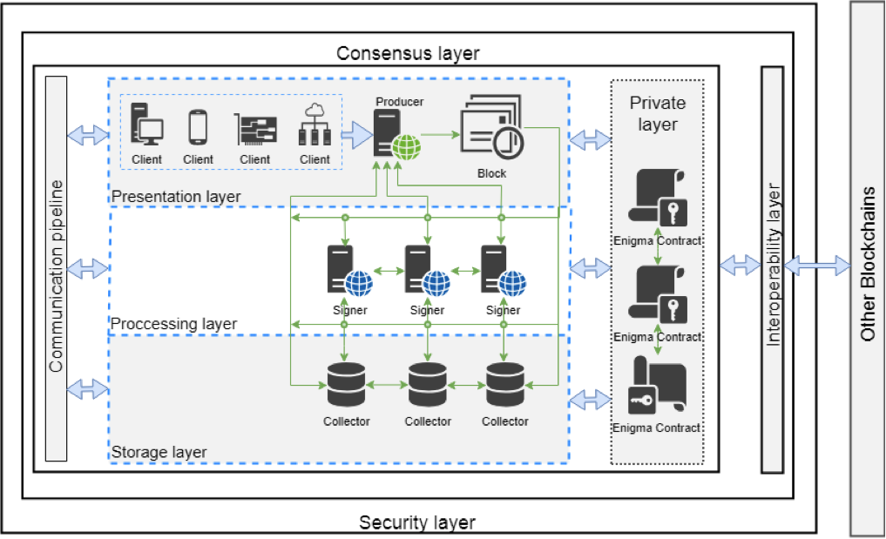

# Ansiblock

Ansiblock was designed to disrupt current limitations of blockchain technology. Ansiblock can achieve more than a million transactions per second without sharding.

## What are we building?
Here are main features of Ansiblock: 
1. Performance and Scalability
    * Provide performance required for people running billions of devices and applications. 
    * Provide low (less than 1 second) latency and finality for blockchain transactions.
    * Provide fast Ansiblock Consensus Algorithm based on Proof-of-Stake.
    * Prodive Decentralised Data Storage over blockchain for storing files and user data objects.
2. Smart Contracts
    * Provide Smart Contract implementation supporting multiple Virtual Machines
    * Provide Smart Contract implementation supporting eBPF and WebAssembly Virtual Machines 
    * Provide “Almost-Turing-Complete” Smart Contract implementation*
3. Interoperability
    * Provide Protocols/API for inter-blockchain transactions.
    * Provide Protocols/API for inter-blockchain assets exchange operations.
4. Privacy & Security
    * Provide “all-known-attack” resistant blockchain with secure Ansiblock Consensus Algorithm
    * Provide Private Layer for encrypting/decrypting user transactions and data.
5. Portability
    * Provide node running under major desktop/server environments.
    * Provide wallets running on mobile devices.
    * Provide applications for IoT devices.
6. Manageability
    * Provide tools for network monitoring and management.
    * Provide node version control and instant update functionality.
7. Developer Oriented
    * Provide language independent Smart Contract development platform supporting C, C++, C#, Crystal, Java, Javascript, Objective-C, Python, Ruby, Rust, Scala, Swift languages.

## Running Ansiblock Test Node
Install [Go](https://golang.org/dl/) and clone the repo.

To run Ansiblock Producer node use:
> cat starter.json | go run cmd/producer/producer.go

To run Ansiblock Signer node use:
> cat starter.json | go run cmd/signer/signer.go "signer_name"

To run random user transactions use:
> cat starter.json | go run cmd/user/user.go

To run unit tests use:
> go test ./...

## Ansiblock Architecture

## Ansiblock Consensus
### Proof of Order
Ansiblock uses Proof-of-Order (PoO) for computational timestamping. Using [VDFs](https://eprint.iacr.org/2018/601.pdf) Ansiblock can timestamp every event in the network and order them accordingly.  

### Proof of State
Proof-of-State (PoST) is cryptographic proof that blockchain is in specific state. State of the blockchain is a “snapshot” of Ansiblock network containing all client data, including accounts, smart contract and other data entities of the blockchain. 

## Contribution
Any contribution is welcome, we are grateful for smallest fixes. Please fork, code, commit and send a pull request, we will review and merge into Ansiblock codebase. 

Our coding guidelines:
* Use standard Go [formating](https://golang.org/doc/effective_go.html#formatting) guidelines.
* Use standard Go [commenting](https://golang.org/doc/effective_go.html#commentary) guidelines.
* If your complex commits please contact us on our [gitter](https://gitter.im/Ansiblock/Lobby) channel.

For more details check our [Developers' Guide](???).

Also please review our [code of conduct](docs/code_of_conduct.md).
